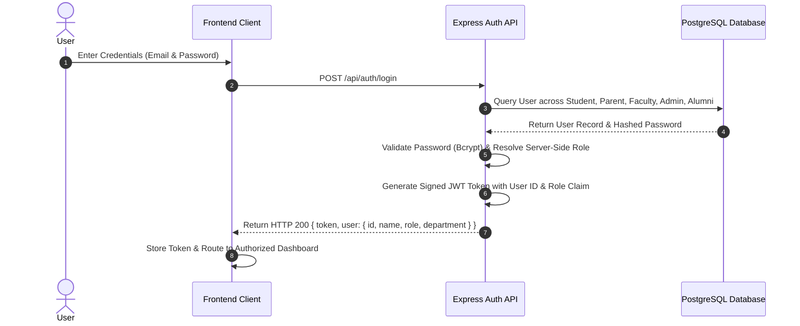
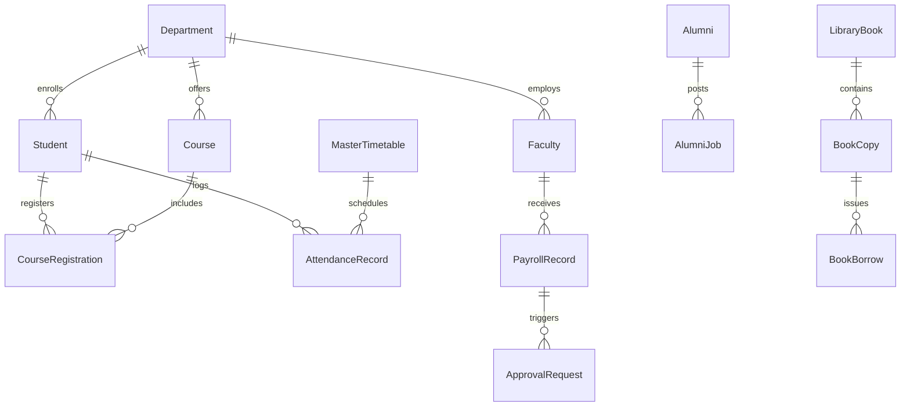

# EDUSUITE PRO
# MASTER PROJECT REQUIREMENTS DOCUMENT

- **Project Name:** EduSuite Pro — Enterprise Higher Education Campus Management System (CMS & ERP)
- **System Type:** All-in-One Higher Education Institutional ERP & Administration Platform
- **Target Institution:** Colleges, Institutes of Technology, Accredited Higher Education Universities
- **Document Version:** 1.0.0 (Master Baseline)
- **Last Updated:** September 04, 2026
- **Requirements Status:** Verified against Active Codebase & Direct PostgreSQL Database Architecture

---

## 1. DOCUMENT OVERVIEW & PURPOSE

This document serves as the **Master Functional & Technical Requirements Specification** for **EduSuite Pro**. It details all functional modules, role-based access control rules, database entity relationships, API specifications, workflow state engines, validation rules, security requirements, and non-functional system constraints.

The primary source of truth for this document is the authoritative repository codebase:
- **Backend Service:** Express.js REST API server with TypeScript, Prisma ORM, JWT authentication, and server-side RBAC middleware.
- **Frontend Service:** React 19 web application built with TanStack Start, TanStack Router, Vite, Radix UI, and Tailwind CSS.
- **Database Layer:** Standalone PostgreSQL Database (`edusuite_db`) managed directly via Prisma ORM schema (`schema.prisma`).

Every feature documented herein is classified using explicit implementation status markers:
- `[IMPLEMENTED]`: Fully functional across Frontend, Backend REST API, and PostgreSQL database.
- `[PARTIALLY IMPLEMENTED]`: Core flows active; specific sub-views or edge operations in progress.
- `[UI ONLY]`: Interactive interface rendered; backed by structured client state or mock adapters.
- `[BACKEND ONLY]`: Database models and Express REST API endpoints available; UI pending integration.
- `[DATABASE ONLY]`: Schema model declared in Prisma ORM; business logic routes pending.
- `[PLANNED]`: Identified future institutional requirement.

---

## 2. SYSTEM OBJECTIVES

EduSuite Pro centralizes higher education campus operations into an integrated, auditable, and secure digital platform.

### Core Institutional Goals:
1. **Unified Data Architecture:** Eliminate departmental silos by anchoring students, faculty, academics, finance, exams, and governance to a single PostgreSQL database.
2. **Server-Side Security & Governance:** Enforce role-based access control (RBAC), multi-tier approval sign-offs, and immutable audit logging at the API layer.
3. **Automated Academic Workflows:** Streamline timetable scheduling, attendance tracking, syllabus progress, internal evaluation, and hall ticket issuance.
4. **Institutional Financial Governance:** Manage multi-stage staff payroll, bank details change requests, student fee ledgers, and expense reimbursements.
5. **Campus Life & Facilities ERP:** Catalog physical library assets, issue digital ID cards, manage hostel rooms, track campus transport routes, and run alumni placement mentorship drives.

---

## 3. USER ROLES CATALOGUE

EduSuite Pro enforces strict security boundaries across **16 Distinct Institutional Roles**:

| Role Key | Display Title | System Scope & Authority | Core Responsibilities |
| :--- | :--- | :--- | :--- |
| `super_admin` | Super Admin | Global System Root Control | RBAC matrix, user lifecycle, department governance, delegation, security anomalies, audit trail |
| `principal` | Principal | Executive Institutional Oversight | Campus performance metrics, emergency broadcasts, high-tier policy sign-offs |
| `dean` | Academic Dean | Academic & Curriculum Control | Curriculum schemes, course allocation, faculty workload balancing, substitution oversight |
| `student_dean` | Student Affairs Dean | Student Welfare & Campus Life | Student grievances, hostel allocations, scholarships, campus discipline |
| `finance_dean` | Finance Officer / Dean | Financial & Payroll Operations | Student fee collection, staff payroll processing, reimbursement approvals, financial audits |
| `examination_dean` | Exam Controller | Examination & Evaluation Cell | Exam timetables, hall tickets, invigilation duty, booklets allocation, grade release |
| `hr` | HR Manager | Human Resources & Personnel | Staff onboarding, leave verification, employee dossier maintenance, appraisals |
| `hod` | Head of Department | Departmental Operations | Faculty supervision, class timetables, lesson plan sign-offs, departmental roster |
| `faculty` | Faculty Member | Classroom & Academic Delivery | Class attendance, LMS materials, assignment grading, internal marks evaluation |
| `student` | Enrolled Student | Academic & LMS Access | Timetable, attendance view, hall ticket download, fee payment, LMS assignments |
| `parent` | Parent / Guardian | Student Monitoring | Student attendance tracking, academic performance view, fee receipts |
| `alumni` | Institutional Alumnus | Alumni Network & Career | Profile dossier, job postings, mentorship sessions, event registrations, donations |
| `librarian` | Head / Staff Librarian | Central Library ERP | Book cataloging, circulation counter (issue/return), fines, digital resources, audit |
| `placement_officer` | Placement Officer | Campus Recruitment | Recruiter onboarding, drive scheduling, resume bank, placement package analytics |
| `iqac` | IQAC Director | Quality Assurance & NAAC | NAAC/NBA criteria management, AQAR reports, institutional benchmarking |
| `research_dean` | R&D Director | Research & Innovations | Research grants, scholar tracking, paper publications, patent repository |

---

## 4. AUTHENTICATION & LOGIN ARCHITECTURE

EduSuite Pro implements a single-entry, server-resolved authentication model. Users enter credentials without manually selecting a role; the backend authenticates identity and dictates the authorized role, scope, and target dashboard.



### Functional Requirements:
- `AUTH-001` `[IMPLEMENTED]`: **Single Login Gateway (`/login`):** Unified authentication form accepting institutional email and password.
- `AUTH-002` `[IMPLEMENTED]`: **Server-Side Role Resolution:** The backend queries `Admin`, `Faculty`, `Student`, `Parent`, and `Alumni` tables to determine identity. Roles are never trusted from client payloads.
- `AUTH-003` `[IMPLEMENTED]`: **Password Hashing:** Passwords are encrypted using `bcryptjs` with salt factor 10.
- `AUTH-004` `[IMPLEMENTED]`: **JSON Web Tokens (JWT):** Authenticated requests include an `Authorization: Bearer <jwt>` header. Tokens expire in 24 hours.
- `AUTH-005` `[IMPLEMENTED]`: **Account Status Safeguard:** Inactive or suspended accounts (`status != "Active"`) are denied access with HTTP 403.
- `AUTH-006` `[IMPLEMENTED]`: **Password Reset Workflow (`/forgot-password`, `/reset-password`):** Secure token generation and reset processing.

---

## 5. ROLE-BASED ACCESS CONTROL (RBAC) REQUIREMENTS

Security boundaries are strictly enforced on every REST API route via server-side middleware (`authenticateToken`, `requireSuperAdmin`).

```
Request → HTTP Bearer JWT → authenticateToken Middleware → Server Role Verification → Route Handler → Response
                                                                  ↓
                                                  Role Unauthorized? → HTTP 403 Forbidden
```

### Authorization Matrix:
- `RBAC-001` `[IMPLEMENTED]`: Enforce server-side authorization check before executing database queries.
- `RBAC-002` `[IMPLEMENTED]`: **Student Boundary:** Enrolled students accessing `/api/super-admin/*` or `/api/payroll/*` receive `HTTP 403 Forbidden`.
- `RBAC-003` `[IMPLEMENTED]`: **Parent Boundary:** Parents are restricted strictly to read-only views of their linked ward's records (`/api/students/:id`).
- `RBAC-004` `[IMPLEMENTED]`: **Faculty Scope:** Faculty members can only mark attendance and LMS grades for courses allocated to them in `SubjectAllocation` or `MasterTimetable`.
- `RBAC-005` `[IMPLEMENTED]`: **Super Admin Root Authority:** Super Admin role bypasses module blocks but writes immutable `AuditLog` records for all administrative mutations.

---

## 6. SUPER ADMIN CONTROL CENTER MODULE

### Module Name: Super Admin Cockpit & Infrastructure Governance
- **Status:** `[IMPLEMENTED]`
- **Route:** `/super-admin/*`
- **APIs:** `/api/super-admin/*`

```
                                  ┌───────────────────────────────────────────┐
                                  │      SUPER ADMIN CONTROL CENTER           │
                                  └─────────────────────┬─────────────────────┘
                                                        │
         ┌──────────────────┬───────────────────┼───────────────────┬──────────────────┐
         │                  │                   │                   │                  │
 ┌───────▼──────┐   ┌───────▼──────┐    ┌───────▼──────┐    ┌───────▼──────┐   ┌───────▼──────┐
 │ User Dossier │   │ Departments  │    │  RBAC Matrix │    │  Delegation  │   │ Audit Trail  │
 └──────────────┘   └──────────────┘    └──────────────┘    └──────────────┘   └──────────────┘
```

#### Functional Requirements:
1. `SUP-001` `[IMPLEMENTED]`: **Infrastructure Health & Metrics Dashboard:** Render real-time system health metrics, total active students, faculty count, department count, and node status derived from PostgreSQL queries.
2. `SUP-002` `[IMPLEMENTED]`: **Global User Management:** Register, update, search, filter, activate, and deactivate accounts across all 16 roles with duplicate email prevention.
3. `SUP-003` `[IMPLEMENTED]`: **Department Governance:** Create and manage academic departments (`CSE`, `ECE`, `EEE`, `CIVIL`, `MECHANICAL`, `IT`, `AI&DS`, `AI&ML`). Prevent deletion of populated departments.
4. `SUP-004` `[IMPLEMENTED]`: **RBAC Matrix Configuration:** Configure dynamic feature permission flags (`canManageUsers`, `canExportData`, `isSystemAdmin`) per role.
5. `SUP-005` `[IMPLEMENTED]`: **Operational Authority Delegation:** Assign time-bound administrative delegation rules (`DEL-101`) to Deans or HODs with active date parameters.
6. `SUP-006` `[IMPLEMENTED]`: **System Audit Trail:** Query immutable system audit logs recording actor ID, name, role, action, module, target entity, IP address, timestamp, and status.
7. `SUP-007` `[IMPLEMENTED]`: **AI Security & Anomaly Engine:** Monitor brute-force IP attacks, concurrent request surges, and suspicious export attempts with automated mitigation actions.
8. `SUP-008` `[IMPLEMENTED]`: **Emergency Broadcast Dispatcher:** Dispatch targeted campus-wide announcements categorized by audience and priority.
9. `SUP-009` `[IMPLEMENTED]`: **Global Search:** Search across Students, Faculty, Staff, Departments, Courses, and System Admins.
10. `SUP-010` `[IMPLEMENTED]`: **Database Backup Snapshot Request:** Trigger database export requests with audit logging.

---

## 7. STUDENT MANAGEMENT MODULE

- **Status:** `[IMPLEMENTED]`
- **Routes:** `/students`, `/student/profile`, `/super-admin/students`
- **APIs:** `/api/students/*`

#### Functional Requirements:
1. `STD-001` `[IMPLEMENTED]`: **Student Dossier Management:** Track comprehensive student profiles including Roll Number (`2026-CSE-001`), Name, Email, Department, Semester, Section, Year, CGPA, Credits Earned, Fee Status, and Parent linkage.
2. `STD-002` `[IMPLEMENTED]`: **Student Directory & Filtering:** Search and filter students by Department, Semester, Section, Academic Year, and Fee Clearance Status.
3. `STD-003` `[IMPLEMENTED]`: **Attendance History Tracking:** Compute individual attendance percentage dynamically from `AttendanceRecord` tables.
4. `STD-004` `[IMPLEMENTED]`: **Parent Linkage:** Establish foreign key relationships between `Student` and `Parent` models for synchronized parent monitoring.

---

## 8. FACULTY & HR MANAGEMENT MODULE

- **Status:** `[IMPLEMENTED]`
- **Routes:** `/faculty/*`, `/hr/*`, `/staff/academic-dean/*`
- **APIs:** `/api/employee/*`, `/api/faculty/*`

#### Functional Requirements:
1. `FAC-001` `[IMPLEMENTED]`: **Faculty Roster Governance:** Track faculty employee records including Employee Roll Number, Name, Email, Department, Role (`hod` or `faculty`), and Status.
2. `FAC-002` `[IMPLEMENTED]`: **Faculty Workload Balancing:** Calculate weekly teaching load hours from `SubjectAllocation` and `MasterTimetable` records.
3. `FAC-003` `[IMPLEMENTED]`: **Live Status Matrix:** Derive real-time faculty availability (In Class, Available, On Leave) based on current timetable period slots.
4. `FAC-004` `[IMPLEMENTED]`: **Proxy & Substitution Governance:** Assign proxy faculty to cover classes when primary faculty are on approved leave.

---

## 9. ACADEMIC & CURRICULUM MANAGEMENT MODULE

- **Status:** `[IMPLEMENTED]`
- **Routes:** `/academics/*`, `/staff/academic-dean/*`
- **APIs:** `/api/courses/*`, `/api/academics/*`

#### Functional Requirements:
1. `ACD-001` `[IMPLEMENTED]`: **Course Catalog Management:** Maintain course records including Code (`CS601`), Name, Credits, Category (`Core`, `Elective`, `Lab`), Semester, Department, and Offered Status.
2. `ACD-002` `[IMPLEMENTED]`: **Curriculum Schemes:** Define regulation frameworks (`R26-BTECH-CSE`) with credit breakdowns for theory, lab, electives, and projects.
3. `ACD-003` `[IMPLEMENTED]`: **Subject Allocation Engine:** Allocate faculty members to course sections per academic term (`SubjectAllocation`).
4. `ACD-004` `[IMPLEMENTED]`: **Syllabus Progress Tracker:** Monitor unit-wise completion progress logged by course instructors.

---

## 10. TIMETABLE MODULE

- **Status:** `[IMPLEMENTED]`
- **Routes:** `/timetable`, `/examcell/timetable`
- **APIs:** `/api/academics/timetable/*`

#### Functional Requirements:
1. `TBL-001` `[IMPLEMENTED]`: **Master Class Timetable:** Manage weekly class timetables structured by Branch, Semester, Section, Day (Monday–Saturday), and Period Slot (1 to 8).
2. `TBL-002` `[IMPLEMENTED]`: **Conflict Prevention:** Enforce database unique constraints (`@@unique([branch, semester, section, day, periodNumber])`) preventing double-booking rooms or faculty.
3. `TBL-003` `[IMPLEMENTED]`: **Faculty Personal Schedule:** Provide individualized daily timetables for instructors based on allocated periods.

---

## 11. ATTENDANCE MODULE

- **Status:** `[IMPLEMENTED]`
- **Routes:** `/attendance`, `/student/attendance`
- **APIs:** `/api/attendance/*`

#### Functional Requirements:
1. `ATT-001` `[IMPLEMENTED]`: **Period-Wise Attendance Marking:** Faculty mark student attendance status (`Present`, `Absent`, `Late`) per timetable period slot.
2. `ATT-002` `[IMPLEMENTED]`: **Duplicate Prevention:** Enforce unique constraint `@@unique([userId, date, periodNumber])` on `AttendanceRecord`.
3. `ATT-003` `[IMPLEMENTED]`: **Automated Percentage Calculation:** Calculate real-time cumulative attendance percentages for hall ticket eligibility checks.

---

## 12. EXAMINATIONS & EVALUATION CELL MODULE

- **Status:** `[IMPLEMENTED]`
- **Routes:** `/examinations/*`, `/examcell/*`
- **APIs:** `/api/exams/*`

```
                                  ┌───────────────────────────────────────────┐
                                  │      EXAMINATION EVALUATION PIPELINE      │
                                  └─────────────────────┬─────────────────────┘
                                                        │
 ┌──────────────────────┐    ┌──────────────────┐    ┌──▼───────────────┐    ┌──────────────────┐
 │ Exam Schedule Build  ├───►│ Hall Ticket Gen  ├───►│ Booklet Allocation├───►│ Marks Lock & Rls │
 └──────────────────────┘    └──────────────────┘    └──────────────────┘    └──────────────────┘
```

#### Functional Requirements:
1. `EXM-001` `[IMPLEMENTED]`: **Exam Schedule Builder:** Publish examination timetables (`exam_schedules`, `exam_timetable_slots`) with date, slot, duration, and exam hall assignments.
2. `EXM-002` `[IMPLEMENTED]`: **Hall Ticket Generation & Release:** Check eligibility thresholds (Attendance >= 75%, Fee Balance == 0) and generate hall tickets (`hall_tickets`).
3. `EXM-003` `[IMPLEMENTED]`: **Answer Booklet Allocation:** Assign digital answer booklets with evaluation codes to evaluation batches (`evaluation_assignment_batches`).
4. `EXM-004` `[IMPLEMENTED]`: **Internal Marks Lock & Grade Sheet:** Lock internal evaluation marks and publish semester grade sheets.

---

## 13. ADMISSIONS & PRE-ADMISSION PORTAL

- **Status:** `[IMPLEMENTED]`
- **Routes:** `/pre-admission` (Public Candidate Portal), `/super-admin/pre-admission` (Admin Workplace)
- **APIs:** `/api/super-admin/pre-admission/*`

#### Functional Requirements:
1. `ADM-001` `[IMPLEMENTED]`: **Public Application Intake (`/pre-admission`):** Candidates apply under Category A (Convener Quota) or Category B (Management Quota) with document uploads.
2. `ADM-002` `[IMPLEMENTED]`: **Candidate Application Tracking:** Candidates track application status via unique tracking IDs.
3. `ADM-003` `[IMPLEMENTED]`: **Admin Application Audit Workspace (`/super-admin/pre-admission`):** Verify candidate credentials, update status (`Under Review`, `Approved`, `Seat Allocated`, `Rejected`), and assign fee quotas.

---

## 14. INSTITUTIONAL APPROVAL WORKFLOW ENGINE

- **Status:** `[IMPLEMENTED]`
- **Routes:** `/approval-workflows`, `/super-admin/approval-requests`
- **APIs:** `/api/approvals/*`

```
 ┌──────────────────┐      ┌────────────────────┐      ┌──────────────────────┐      ┌─────────────────────────┐
 │ Request Creation ├─────►│ Stage 1: HR Audit  ├─────►│ Stage 2: Finance Rev ├─────►│ Stage 3: Super Admin    │
 └──────────────────┘      └────────────────────┘      └──────────────────────┘      └────────────┬────────────┘
                                                                                                  │
                                                                                       ┌──────────▼──────────┐
                                                                                       │ Final Execution     │
                                                                                       └─────────────────────┘
```

#### Functional Requirements:
1. `APP-001` `[IMPLEMENTED]`: **Multi-Tier Approval Engine:** Orchestrate approval requests across 3 sequential stages: `HR_VERIFICATION` → `FINANCE_REVIEW` → `SUPER_ADMIN_PENDING` → `FINALIZED`.
2. `APP-002` `[IMPLEMENTED]`: **Supported Request Types:** Support `PAYROLL`, `REIMBURSEMENT`, `BANK_CHANGE`, `ATTENDANCE`, `LEAVE`, `EXAM`, `FINANCE`, `CLEARANCE`, and `SECURITY`.
3. `APP-003` `[IMPLEMENTED]`: **Sign-Off & Audit Logging:** Record stage verifier IDs, notes, decision timestamps, and rejection reasons.

---

## 15. FINANCE & PAYROLL OPERATIONS MODULE

- **Status:** `[IMPLEMENTED]`
- **Routes:** `/finance/*`, `/super-admin/payroll`, `/staff/finance-dean/*`
- **APIs:** `/api/payroll/*`

#### Functional Requirements:
1. `FIN-001` `[IMPLEMENTED]`: **Staff Salary Structure:** Manage basic pay, DA, HRA, academic allowances, PF, income tax, and net salary parameters (`SalaryStructure`).
2. `FIN-002` `[IMPLEMENTED]`: **Monthly Payroll Processing:** Process monthly staff payroll records (`PayrollRecord`) linked to multi-stage approval workflows.
3. `FIN-003` `[IMPLEMENTED]`: **Bank Details & Change Governance:** Secure employee bank details (`BankDetails`) and mandate approval for change requests (`BankChangeRequest`).
4. `FIN-004` `[IMPLEMENTED]`: **Reimbursement Claims:** Process travel, research grant, and book purchase expense claims (`Reimbursement`).

---

## 16. ALUMNI & CAREER NETWORK MODULE

- **Status:** `[IMPLEMENTED]`
- **Routes:** `/alumni`, `/super-admin/alumni-analytics`
- **APIs:** `/api/admin/alumni/analytics/*`

#### Functional Requirements:
1. `ALM-001` `[IMPLEMENTED]`: **Alumni Directory & Profiles:** Track graduate records, batch years, current companies, designations, and country locations (`Alumni`).
2. `ALM-002` `[IMPLEMENTED]`: **Alumni Job & Referral Engine:** Post job openings (`AlumniJob`) and process student referral requests (`ReferralRequest`).
3. `ALM-003` `[IMPLEMENTED]`: **Mentorship Scheduling:** Connect alumni mentors (`AlumniMentorship`) with students for career sessions (`MentorshipSession`).
4. `ALM-004` `[IMPLEMENTED]`: **Global Reunions & Events:** Manage alumni events (`AlumniEvent`), ticket QR tokens, and registrations.
5. `ALM-005` `[IMPLEMENTED]`: **Campus Growth Endowment:** Track alumni donations (`AlumniDonation`) and endowment campaign contributions.
6. `ALM-006` `[IMPLEMENTED]`: **Internal Alumni Analytics:** Compute department career distributions, top employers, and geographical placement heatmaps.

---

## 17. CENTRAL LIBRARY MANAGEMENT ERP MODULE

- **Status:** `[IMPLEMENTED]`
- **Routes:** `/library/*`, `/student/library`, `/librarian/*`
- **APIs:** `/api/library/*`

```
 ┌────────────────────┐    ┌─────────────────┐    ┌────────────────────┐    ┌─────────────────┐
 │ Library Cataloging ├───►│ Book Copy RFID  ├───►│ Circulation Desk   ├───►│ Fine & Return   │
 └────────────────────┘    └─────────────────┘    └────────────────────┘    └─────────────────┘
```

#### Functional Requirements:
1. `LIB-001` `[IMPLEMENTED]`: **Book Catalog & Inventory:** Catalog books (`LibraryBook`) with ISBN, Title, Authors, Publisher, Accession Numbers, and Racks.
2. `LIB-002` `[IMPLEMENTED]`: **Copy Tracking:** Track physical copies (`BookCopy`) with barcode, RFID tag, and availability status.
3. `LIB-003` `[IMPLEMENTED]`: **Circulation Counter:** Handle book issue and return transactions (`BookBorrow`) with automatic due date calculation.
4. `LIB-004` `[IMPLEMENTED]`: **Overdue Fines Engine:** Calculate overdue fines (`LibraryFine`) and issue payment receipts.
5. `LIB-005` `[IMPLEMENTED]`: **Library ID Cards & Gate Entry:** Approve digital library ID cards (`LibraryIDCard`) and log gate entry/exit (`LibraryGateEntry`).
6. `LIB-006` `[IMPLEMENTED]`: **Reading Hall Seat Reservation:** Track seat occupancy (`ReadingHallSeat`) across silent, digital, and discussion zones.

---

## 18. LMS & STUDY MATERIALS MODULE

- **Status:** `[IMPLEMENTED]`
- **Routes:** `/student/lms`, `/faculty/lms`
- **APIs:** `/api/lms/*`, `/api/student/lms/*`

#### Functional Requirements:
1. `LMS-001` `[IMPLEMENTED]`: **Study Resource Repository:** Upload and publish study notes, PDFs, PPTs, and video links (`LmsResource`).
2. `LMS-002` `[IMPLEMENTED]`: **Course Assignments:** Create assignments (`lms_assignments`) with question paper downloads and due dates.
3. `LMS-003` `[IMPLEMENTED]`: **Student Submission Tracking:** Log student assignment answer file uploads (`lms_assignment_submissions`) and faculty grades.

---

## 19. NOTIFICATION SYSTEM

- **Status:** `[IMPLEMENTED]`
- **Routes:** Nav Topbar Notification Center
- **APIs:** `/api/notifications/*`

#### Functional Requirements:
1. `NTF-001` `[IMPLEMENTED]`: **User Notification Inbox:** Deliver targeted notifications (`Notification`) to students, faculty, and admins.
2. `NTF-002` `[IMPLEMENTED]`: **Read Status Governance:** Support marking notifications as read individually or in bulk (`mark-all-read`).

---

## 20. REPORTING & EXPORTS

- **Status:** `[IMPLEMENTED]`

| Report Title | Target Audience | Data Source | Format | Authorization |
| :--- | :--- | :--- | :--- | :--- |
| **System User Roster** | Super Admin | `Admin`, `Faculty`, `Student` | CSV Export | `requireSuperAdmin` |
| **Faculty Workload Analysis** | Academic Dean, HOD | `SubjectAllocation`, `MasterTimetable` | Interactive / CSV | `authenticateToken` |
| **Student Attendance Report** | Faculty, Deans | `AttendanceRecord`, `Student` | PDF / CSV | `authenticateToken` |
| **Staff Payslip & Payroll** | Finance Dean, HR | `PayrollRecord`, `SalaryStructure` | Printable PDF | `authenticateToken` |
| **Examination Grade Sheet** | Exam Controller | `answer_booklets`, `hall_tickets` | PDF / Printable | `authenticateToken` |
| **Alumni Analytics Report** | Alumni Director | `Alumni`, `AlumniJob`, `AlumniDonation` | Interactive / CSV | `authenticateToken` |
| **Library Stock Audit** | Librarian | `LibraryBook`, `BookCopy` | CSV / PDF | `authenticateToken` |

---

## 21. DATABASE REQUIREMENTS & SCHEMA ARCHITECTURE

- **Engine:** Standalone PostgreSQL 18
- **ORM:** Prisma ORM (`@prisma/client`)
- **Connection String:** `DATABASE_URL="postgresql://postgres@localhost:5433/edusuite_db?schema=public"`



---

## 22. SECURITY & DATA INTEGRITY REQUIREMENTS

1. `SEC-001` `[IMPLEMENTED]`: **Server-Side Enforcement:** Enforce authentication and RBAC checks on every Express API route.
2. `SEC-002` `[IMPLEMENTED]`: **Credential Isolation:** Never expose database connection strings, passwords, or JWT secrets in client responses.
3. `SEC-003` `[IMPLEMENTED]`: **SQL Injection Prevention:** Execute queries via Prisma ORM parameterized client queries.
4. `SEC-004` `[IMPLEMENTED]`: **Auditability:** Record administrative mutations in the `AuditLog` table.

---

## 23. NON-FUNCTIONAL REQUIREMENTS

- `NFR-001` **Performance:** API queries execute within 200ms using PostgreSQL indexing.
- `NFR-002` **Reliability:** Prisma client connection pooling configured (`connection_limit=3`).
- `NFR-003` **Portability:** Containerized local PostgreSQL docker setup supported (`docker-compose.yml`).

---

## 24. REQUIREMENTS TRACEABILITY MATRIX

| Requirement ID | Module | Requirement Description | Implementation Source | Status |
| :--- | :--- | :--- | :--- | :--- |
| `AUTH-001` | Auth | Unified Login Gateway | `edusuite-frontend/src/routes/login.tsx` | `[IMPLEMENTED]` |
| `AUTH-002` | Auth | Server-Side Role Resolution | `edusuite-backend/src/modules/auth/auth.routes.ts` | `[IMPLEMENTED]` |
| `RBAC-001` | RBAC | Middleware Role Authorization | `edusuite-backend/src/modules/super-admin/super-admin.routes.ts` | `[IMPLEMENTED]` |
| `SUP-001` | Super Admin | System Metrics & Health Dashboard | `edusuite-backend/src/modules/super-admin/super-admin.routes.ts` | `[IMPLEMENTED]` |
| `SUP-002` | Super Admin | Global User Management | `edusuite-backend/src/modules/super-admin/super-admin.routes.ts` | `[IMPLEMENTED]` |
| `SUP-003` | Super Admin | Department Governance | `edusuite-backend/src/modules/super-admin/super-admin.routes.ts` | `[IMPLEMENTED]` |
| `SUP-006` | Super Admin | Immutable Audit Trail Logging | `edusuite-backend/src/modules/super-admin/super-admin.routes.ts` | `[IMPLEMENTED]` |
| `STD-001` | Students | Student Dossier Maintenance | `edusuite-backend/src/modules/students/students.routes.ts` | `[IMPLEMENTED]` |
| `FAC-001` | Faculty | Faculty Roster & Workload | `edusuite-backend/src/modules/employees/employees.routes.ts` | `[IMPLEMENTED]` |
| `ACD-001` | Academics | Course Catalog Governance | `edusuite-backend/src/modules/academics/academics.routes.ts` | `[IMPLEMENTED]` |
| `TBL-001` | Timetable | Master Timetable Engine | `edusuite-backend/src/modules/academics/academics.routes.ts` | `[IMPLEMENTED]` |
| `ATT-001` | Attendance | Period-Wise Attendance Marking | `edusuite-backend/src/modules/attendance/attendance.routes.ts` | `[IMPLEMENTED]` |
| `EXM-001` | Examinations| Exam Schedule & Hall Tickets | `edusuite-backend/src/modules/exams/exams.routes.ts` | `[IMPLEMENTED]` |
| `ADM-001` | Admissions | Pre-Admission Candidate Intake | `edusuite-frontend/src/routes/pre-admission.tsx` | `[IMPLEMENTED]` |
| `APP-001` | Approvals | 3-Tier Approval Workflow Engine| `edusuite-backend/src/modules/approvals/approvals.routes.ts` | `[IMPLEMENTED]` |
| `FIN-001` | Payroll | Monthly Payroll & Bank Changes | `edusuite-backend/src/modules/payroll/payroll.routes.ts` | `[IMPLEMENTED]` |
| `ALM-001` | Alumni | Alumni Network & Analytics | `edusuite-backend/src/modules/alumni-analytics/alumni-analytics.routes.ts` | `[IMPLEMENTED]` |
| `LIB-001` | Library | Central Library ERP | `edusuite-backend/src/modules/library/library.routes.ts` | `[IMPLEMENTED]` |
| `LMS-001` | LMS | LMS Materials & Assignments | `edusuite-backend/src/modules/lms/lms.routes.ts` | `[IMPLEMENTED]` |
| `NTF-001` | Notifications| System Notification Inbox | `edusuite-backend/src/modules/notifications/notifications.routes.ts` | `[IMPLEMENTED]` |

---

## 25. IMPLEMENTED VS PLANNED FUNCTIONALITY SUMMARY

### 🟢 Implemented (Verified in Codebase):
- Authentication & JWT Authorization with Server-Side Role Resolution
- Super Admin Cockpit (Users, Departments, RBAC, Delegation, Audit Logs, Security Anomaly, Emergency Broadcast)
- Student & Parent Directory with Attendance Percentage Calculation
- Faculty Roster, Workload Balancing, and Live Status Matrix
- Academic Course Catalog, Curriculum Schemes, and Subject Allocation
- Master Class Timetable with Period Conflict Safeguards
- Period-Wise Student Attendance Marking & History
- Examination Schedule Builder, Hall Ticket Generator, Answer Booklet Evaluation, and Internal Marks Lock
- Public Pre-Admission Candidate Portal & Admin Audit Workspace
- 3-Tier Approval Workflow Engine (`HR_VERIFICATION` → `FINANCE_REVIEW` → `SUPER_ADMIN_PENDING`)
- Staff Payroll Processing, Salary Structures, Bank Detail Change Governance, and Expense Reimbursements
- Alumni Directory, Career Referrals, Mentorship Sessions, Events, Donations, and Internal Analytics
- Central Library ERP (Cataloging, Copy Tracking, Circulation Issue/Return, Fines, ID Cards, Seat Reservations)
- LMS Study Materials Repository and Assignment Submission Tracking
- Notification Center and CSV/PDF Reporting Tools

### 🟡 Planned / Future Enhancements:
- Automated Biometric / RFID IoT Hardware Gate Integration for Real-Time Library & Hostel Attendance
- Payment Gateway Webhook Integration for Live Credit Card / UPI Online Fee Settlement
